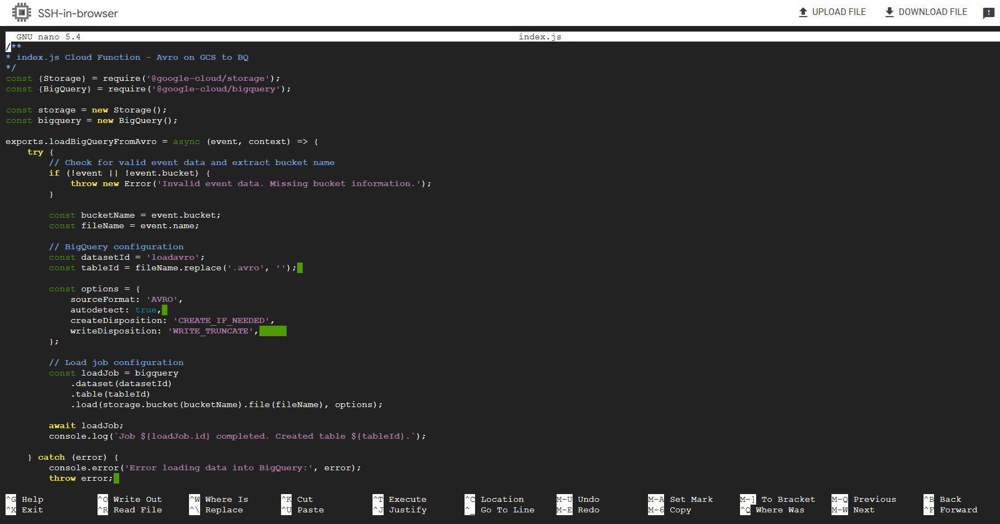
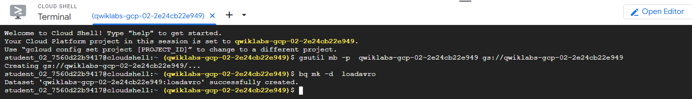
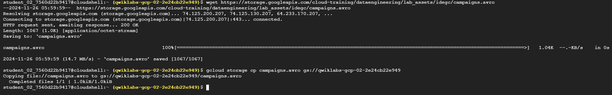

# Use Cloud Run Functions to Load BigQuery

### Create a function

1. In the Cloud Console, on the Navigation menu (Navigation menu), click Compute Engine. You should see a provisioned linux instance:

2. Click on the SSH button. You will be brought to an interactive shell.

3. In the SSH terminal, run the following command to set the Cloud Run functions region:

```bash
gcloud config set functions/region REGION
```

4. Create and open index.js to edit:

```bash
nano index.js
```

5. Copy the following into the index.js file; this the code for the Cloud Function.

```javascript
/**
 * index.js Cloud Function - Avro on GCS to BQ
 */
const { Storage } = require("@google-cloud/storage");
const { BigQuery } = require("@google-cloud/bigquery");

const storage = new Storage();
const bigquery = new BigQuery();

exports.loadBigQueryFromAvro = async (event, context) => {
  try {
    // Check for valid event data and extract bucket name
    if (!event || !event.bucket) {
      throw new Error("Invalid event data. Missing bucket information.");
    }

    const bucketName = event.bucket;
    const fileName = event.name;

    // BigQuery configuration
    const datasetId = "loadavro";
    const tableId = fileName.replace(".avro", "");

    const options = {
      sourceFormat: "AVRO",
      autodetect: true,
      createDisposition: "CREATE_IF_NEEDED",
      writeDisposition: "WRITE_TRUNCATE",
    };

    // Load job configuration
    const loadJob = bigquery
      .dataset(datasetId)
      .table(tableId)
      .load(storage.bucket(bucketName).file(fileName), options);

    await loadJob;
    console.log(`Job ${loadJob.id} completed. Created table ${tableId}.`);
  } catch (error) {
    console.error("Error loading data into BigQuery:", error);
    throw error;
  }
};
```



6. Exit nano (Ctrl+x) and save (Y) the file.

### Create a Cloud Storage bucket and BigQuery dataset

1. Use the following command to create a new Cloud Storage bucket as a staging location:

```bash
gsutil mb -p  PROJECT_ID gs://PROJECT_ID
```

2. Create a BQ dataset to store the data.

```bash
bq mk -d  loadavro
```



### Deploy your function

1. In order to ensure all system settings are in place disable and re-enable the Cloud Run functions API. First you need to disable the Cloud Run functions API:

```bash
gcloud services disable cloudfunctions.googleapis.com
```

2. Re-enable the Cloud Run functions API:

```bash
gcloud services enable cloudfunctions.googleapis.com
```

3. For the Cloud Run function to process you must add the artifactregistry.reader permission to your appspot service account.

```bash
gcloud projects add-iam-policy-binding PROJECT_ID \
--member="serviceAccount:PROJECT_ID@appspot.gserviceaccount.com" \
--role="roles/artifactregistry.reader"
```

4. Two javascript libraries must be installed to read from Cloud Storage and store the output in BigQuery.

```bash
npm install @google-cloud/storage @google-cloud/bigquery
```

> **Note**: You may safely ignore any messages during the library installation that show entries like **Unsupported Engine**.

5. Deploy the function using the command below.

```bash
gcloud functions deploy loadBigQueryFromAvro \
    --project PROJECT_ID \
    --runtime nodejs20 \
    --trigger-resource gs://PROJECT_ID \
    --trigger-event google.storage.object.finalize \
    --no-gen2
```

6. In the termial output of the function deployment you will see status showing as Active. This indicates that the function has been successfully deployed.

7. Next, download the Avro file that will be processed by the Cloud Run function for storage in BigQuery.

```bash
wget https://storage.googleapis.com/cloud-training/dataengineering/lab_assets/idegc/campaigns.avro
```

8. Move the Avro file to the staging Cloud Storage bucket you created earlier. This action will trigger the Cloud Run function.

```bash
gcloud storage cp campaigns.avro gs://PROJECT_ID
```



### Confirm that the data was loaded into BigQuery

1. To view the data in the new table in BigQuery, run the following query in the SSH terminal using the bq command.

```bash
bq query \
 --use_legacy_sql=false \
 'SELECT * FROM `loadavro.campaigns`;'
```

> **Note**: The Cloud Run function will typically process very quickly but it is possible the query run against BigQuery may not return results. If that is the case for you please wait a moment and run the query again.

2. The query should return results similiar to the following:
   Example output:

### View logs

1. To check the logs and see your messages in the log history run the following command in the SSH terminal.

```bash
gcloud functions logs read loadBigQueryFromAvro
```

2. Messages in the log appear similar to the following:
