# Streaming Data Pipeline for a Real-Time Dashboard with Dataflow

### Create a BigQuery dataset

1. In Cloud Shell (Cloud Shell icon), run the following command to create the taxirides dataset.

```bash
bq --location=Region mk taxirides
```

2. Run this command to create the taxirides.realtime table (empty schema that you will stream into later).

```bash
bq --location=Region mk \
--time_partitioning_field timestamp \
--schema ride_id:string,point_idx:integer,latitude:float,longitude:float,\
timestamp:timestamp,meter_reading:float,meter_increment:float,ride_status:string,\
passenger_count:integer -t taxirides.realtime
```

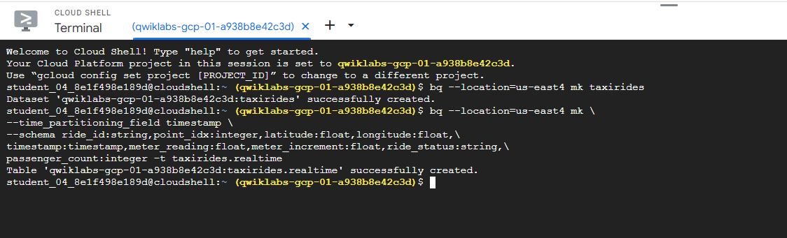

### Copy required lab artifacts

1. In Cloud Shell, run the following commands to move files needed for the Dataflow job.

```bash
gcloud storage cp gs://cloud-training/bdml/taxisrcdata/schema.json  gs://Project_ID-bucket/tmp/schema.json
gcloud storage cp gs://cloud-training/bdml/taxisrcdata/transform.js  gs://Project_ID-bucket/tmp/transform.js
gcloud storage cp gs://cloud-training/bdml/taxisrcdata/rt_taxidata.csv  gs://Project_ID-bucket/tmp/rt_taxidata.csv
```

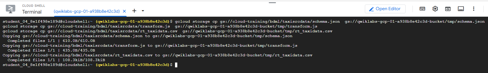

### Set up a Dataflow Pipeline

#### Restart the connection to the Dataflow API.

1. In the Cloud Shell, run the following commands to ensure that the Dataflow API is enabled cleanly in your project.

```bash
gcloud services disable dataflow.googleapis.com
gcloud services enable dataflow.googleapis.com
```

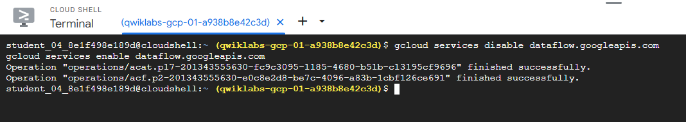

#### Create a new streaming pipeline:

1. In the Cloud console, in the Navigation menu (Navigation Menu), click Dataflow.

2. In the top menu bar, click Create Job From Template.

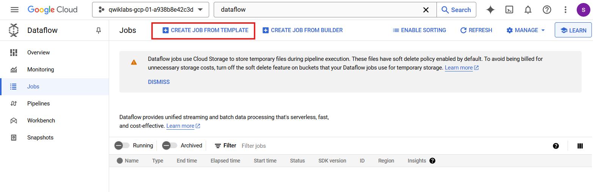

3. Type streaming-taxi-pipeline as the Job name for your Dataflow job.

4. In Regional endpoint, select

```bash
Region
```

5. In Dataflow template, select the Cloud Storage Text to Bigquery (Stream) template under Process Data Continuously (stream).

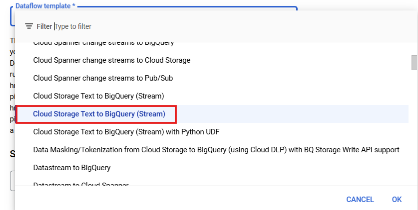

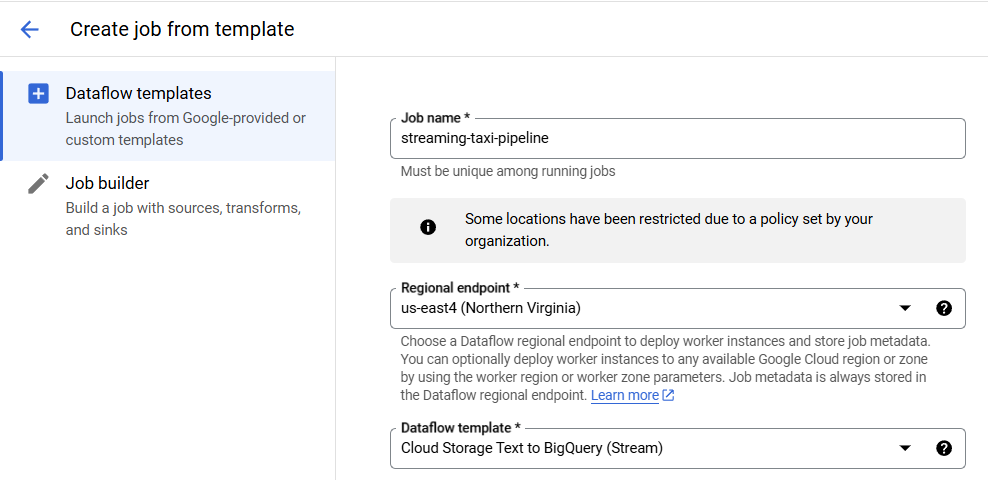

> **Note**: Make sure to select the template option which matches with the parameters listed below.

6. In The GCS location of the text you'd like to process, paste or type:

```bash
gs://Project_ID-bucket/tmp/rt_taxidata.csv
```

7. In GCS location of your BigQuery schema file, described as a JSON, paste or type:

```bash
Project_ID-bucket/tmp/schema.json
```

8. In Output table to write to, paste or type:

```bash
Project_ID:taxirides.realtime
```

9. In GCS path to javascript fn for transforming output, paste or type:

```bash
gs://Project_ID-bucket/tmp/transform.js
```

10. In UDF JavaScript function name, paste or type:

```bash
transform
```

> **Note**: There is a colon : between the project and dataset name and a dot . between the dataset and table name.

11. In Temporary directory for BigQuery loading process, paste or type:

```bash
Project_ID-bucket/tmp
```

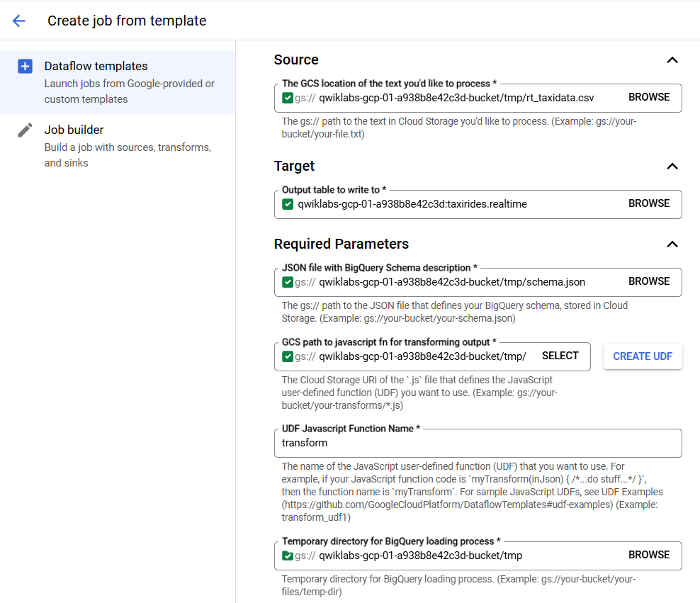

12. Click Optional Parameters.

13. In Max workers, type 2

14. In Number of workers, type 1

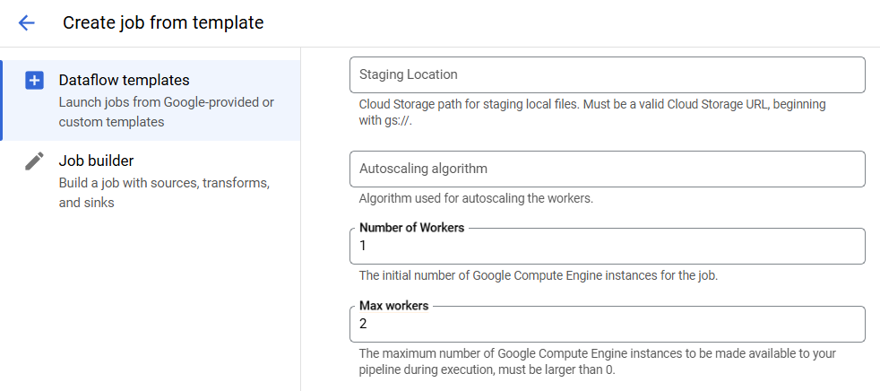

15. Uncheck Use default machine type.

16. Under General purpose, choose the following:

> Series: E2 \
> Machine type: e2-medium (2 vCPU, 4 GB memory)

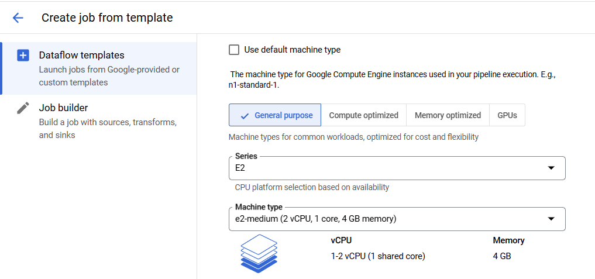

17. Click Run Job.

> A new streaming job has started! You can now see a visual representation of the data pipeline. It will take 3 to 5 minutes for data to begin moving into BigQuery.

> Note: If the dataflow job fails for the first time then re-create a new job template with new job name and run the job.

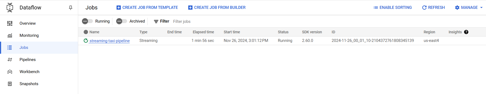

### Analyze the taxi data using BigQuery

1. In the Cloud console, in the Navigation menu (Navigation Menu), click BigQuery.

2. If the Welcome dialog appears, click Done.

3. In the Query Editor, type the following, and then click Run:

```bash
SELECT * FROM taxirides.realtime LIMIT 10
```

> **Note**: If no records are returned, wait another minute and re-run the above query (Dataflow takes 3-5 minutes to setup the stream).

Your output will look similar to the following:

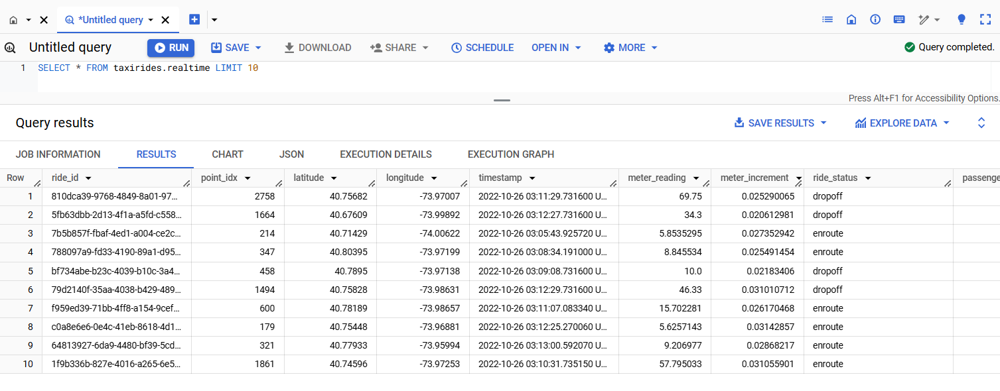

### Perform aggregations on the stream for reporting

1. In the Query Editor, clear the current query.

2. Copy and paste the following query, and then click Run.

```sql
WITH streaming_data AS (

SELECT
  timestamp,
  TIMESTAMP_TRUNC(timestamp, HOUR, 'UTC') AS hour,
  TIMESTAMP_TRUNC(timestamp, MINUTE, 'UTC') AS minute,
  TIMESTAMP_TRUNC(timestamp, SECOND, 'UTC') AS second,
  ride_id,
  latitude,
  longitude,
  meter_reading,
  ride_status,
  passenger_count
FROM
  taxirides.realtime
ORDER BY timestamp DESC
LIMIT 1000

)

# calculate aggregations on stream for reporting:
SELECT
 ROW_NUMBER() OVER() AS dashboard_sort,
 minute,
 COUNT(DISTINCT ride_id) AS total_rides,
 SUM(meter_reading) AS total_revenue,
 SUM(passenger_count) AS total_passengers
FROM streaming_data
GROUP BY minute, timestamp
```

> **Note**: Ensure Dataflow is registering data in BigQuery before proceeding to the next task.

The result shows key metrics by the minute for every taxi drop-off.

3. Click Save > Save query.

4. In the Save query dialog, in the Name field, type My Saved Query.

5. Click Save.

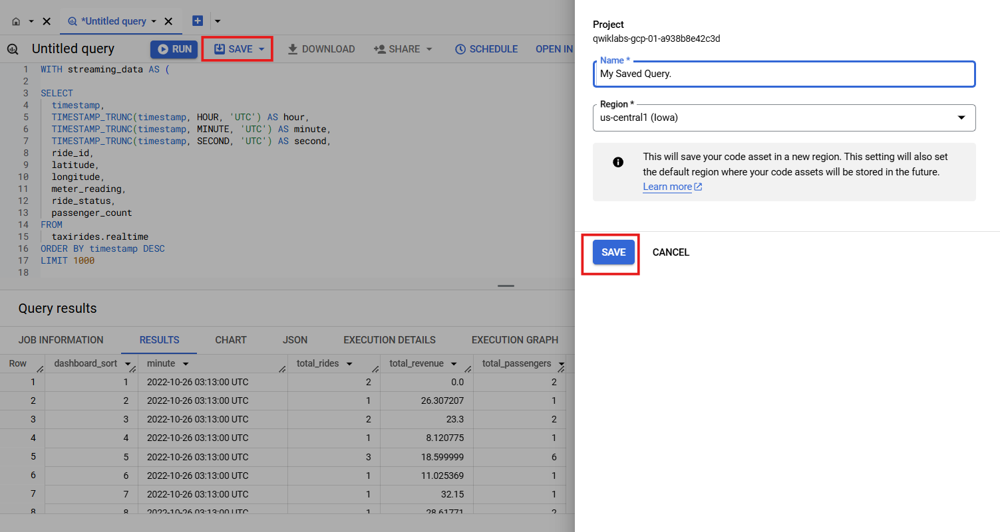

### Stop the Dataflow Job

1. In the Cloud console, in the Navigation menu (Navigation Menu), click Dataflow.

2. Click the streaming-taxi-pipeline, or the new job name.

3. Click Stop, and then select Cancel > Stop Job.

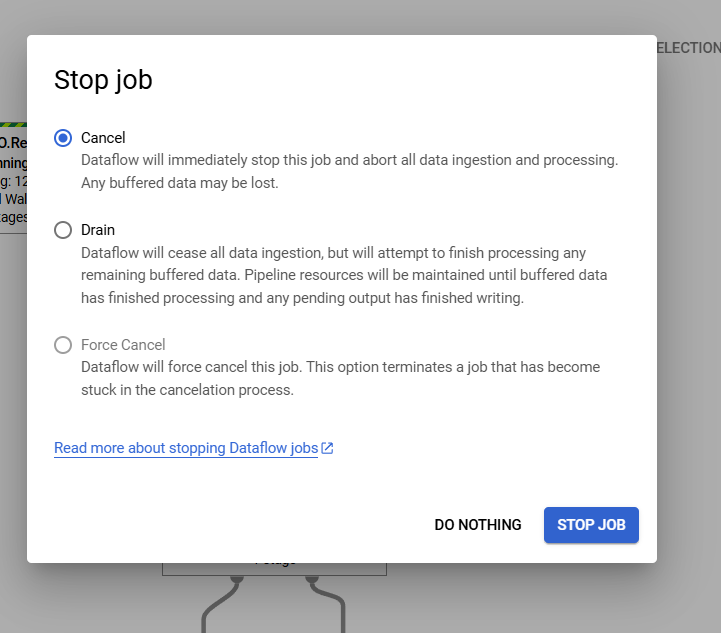

### Create a real-time dashboard

1. In the Cloud console, in the Navigation menu (Navigation Menu), click BigQuery.

2. In the Explorer Pane, expand your Project ID.

3. Expand Saved queries, and then click My Saved Query.

Your query is loaded in to the query editor.

4. Click Run.

5. In BigQuery, click Explore Data > Explore with Looker Studio.

6. Looker Studio Opens. Click Get started.

7. In the Looker Studio window, click your bar chart.

> The Chart pane appears.

8. Click Add a chart, and then select Combo chart.

9. In the Setup pane, in Data Range Dimension, hover over minute (Date) and click X to remove it.

10. In the Data pane, click dashboard_sort and drag it to Setup > Data Range Dimension > Add dimension.

11. In Setup > Dimension, click minute, and then select dashboard_sort.

12. In Setup > Metric, click dashboard_sort, and then select total_rides.

13. In Setup > Metric, click Record Count, and then select total_passengers.

14. In Setup > Metric, click Add metric, and then select total_revenue.

15. In Setup > Sort, click total_rides, and then select dashboard_sort.

16. In Setup > Sort, click Ascending.

Your chart should look similar to this:

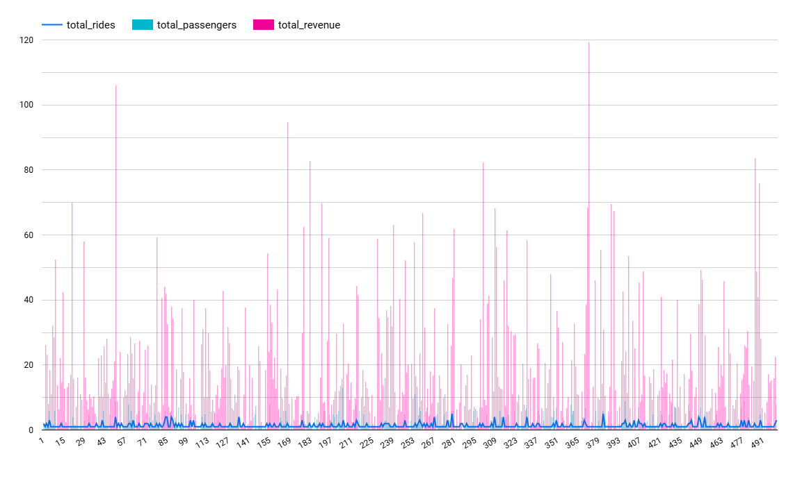

> **Note**: Visualizing data at a minute-level granularity is currently not supported in Looker Studio as a timestamp. This is why we created our own dashboard_sort dimension.

17. When you're happy with your dashboard, click **Save and share** to save this data source.

18. If prompted to complete your account setup, agree to the terms and conditions, and then click **Continue**.

If prompted which updates you want to receive, answer **no** to all, then click **Continue**.

If prompted with the **Review data access before saving** window, click **Acknowledge and save**.

If prompted to choose an account select your **Student Account**.

Click **Add to report**.

Whenever anyone visits your dashboard, it will be up-to-date with the latest transactions. You can try it yourself by clicking **More options**, and then **Refresh data**.

### Create a time series dashboard

1. Click this Looker Studio link to open Looker Studio in a new browser tab.

2. On the Reports page, in the Start with a Template section, click the [+] Blank Report template.

3. A new, empty report opens with the Add data to report window.

4. From the list of Google Connectors, select the BigQuery tile.

5. Click Custom Query, and then select your ProjectID. This should appear in the following format, qwiklabs-gcp-xxxxxxx.

6. In Enter Custom Query, paste the following query:

```sql
SELECT
  *
FROM
  taxirides.realtime
WHERE
  ride_status='enroute'
```

7. Click Add > Add To Report.

> A new untitled report appears. It may take up to a minute for the screen to finish refreshing.

#### Create a time series chart

1. In the Data pane, click Add a Field > Add calculated field.

2. Click All Fields on the left corner.

3. Change the timestamp field type to Date & Time > Date Hour Minute (YYYYMMDDhhmm).

4. In the change timestamp dialog, click Continue, and then click Done.

5. In the top menu, click Add a chart.

6. Choose Time series chart.

7. Position the chart in the bottom left corner - in the blank space.

8. In Setup > Dimension, click timestamp (Date), and then select timestamp.

9. In Setup > Dimension, click timestamp, and then select calendar.

10. In Type, select Date & Time > Date Hour Minute.

11. Click outside the dialog to close it. You do not need to add a name.

12. In Setup > Metric, click Record Count, and then select meter reading.
